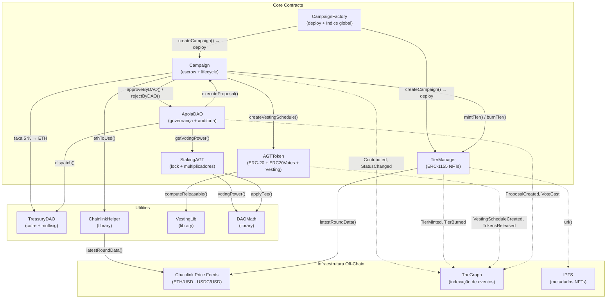
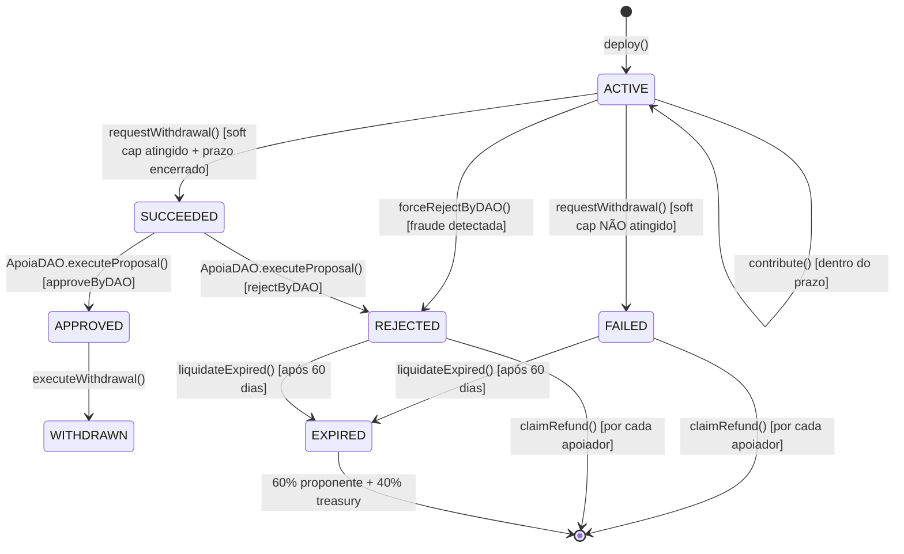
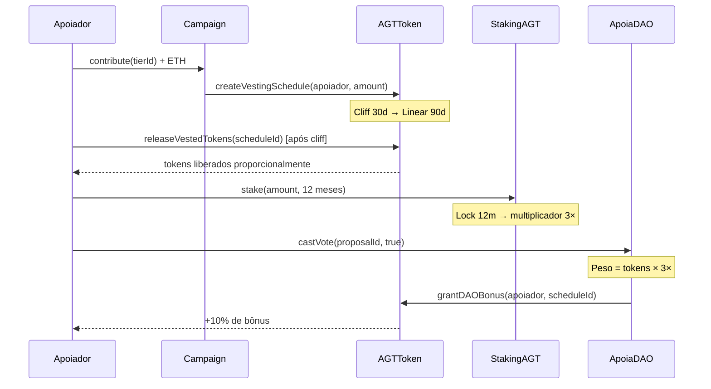

# Apoia Protocol — Diagrama de Dependências

## Fluxo de Status da Campanha

## Ciclo de Vida de um $AGT (Cashback)

## Dependências de Bibliotecas

| Contrato       | VestingLib | DAOMath | ChainlinkHelper |
|----------------|:----------:|:-------:|:---------------:|
| AGTToken       | ✓          |         |                 |
| Campaign       |            | ✓       | ✓               |
| StakingAGT     |            | ✓       |                 |
| ApoiaDAO       |            | ✓       |                 |
| TierManager    |            |         | ✓               |

## Dependências de Contratos OpenZeppelin

| Contrato        | ERC20 | ERC20Votes | ERC1155 | Ownable | ReentrancyGuard | Pausable |
|-----------------|:-----:|:----------:|:-------:|:-------:|:---------------:|:--------:|
| AGTToken        | ✓     | ✓          |         | ✓       | ✓               |          |
| TierManager     |       |            | ✓       | ✓       |                 |          |
| Campaign        |       |            |         |         | ✓               | ✓        |
| CampaignFactory |       |            |         | ✓       | ✓               |          |
| StakingAGT      |       |            |         | ✓       | ✓               | ✓        |
| ApoiaDAO        |       |            |         | ✓       | ✓               |          |
| TreasuryDAO     |       |            |         | ✓       | ✓               |          |
